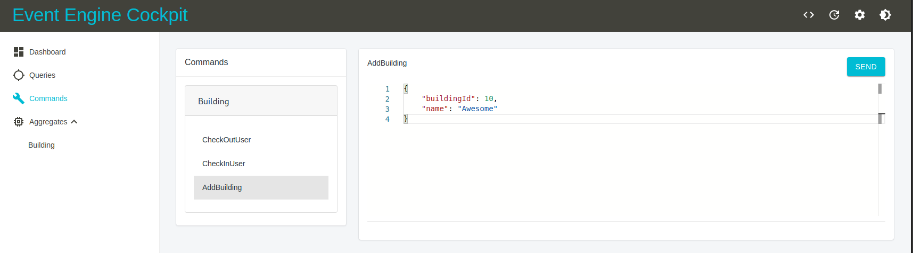

# php-code-generator-tutorial-demo

Code Generation example implementation for [https://event-engine.io/tutorial/](https://event-engine.io/tutorial/) based on
[https://github.com/event-engine/php-engine-skeleton](https://github.com/event-engine/php-engine-skeleton).

Please refer to the *php-engine-skeleton* documentation if you have any trouble to get it up and running.

## Installation
Please make sure you have installed [Docker](https://docs.docker.com/engine/installation/ "Install Docker") 
and [Docker Compose](https://docs.docker.com/compose/install/ "Install Docker Compose").

```bash
$ docker run --rm -it -v $(pwd):/app prooph/composer:7.4 install
$ sudo chown $(id -u -n):$(id -g -n) . -R
$ docker-compose up -d
$ docker-compose run --rm php php scripts/create_event_stream.php
$ docker-compose run --rm php php scripts/create_collections.php
```

Head over to `https://localhost` to check if the containers are up and running.
Accept the self-signed certificate and you should see a "It works" message.

## Code Generation

The file [tutorial-building.xml](./tutorial-building.xml "Buildings Tutorial Domain as XML") contains the exported version of the 
[buildings tutorial domain](https://event-engine.io/tutorial/intro.html#2-1) from [InspectIO](https://github.com/event-engine/inspectio "InspectIO").

The file [open-code-modeling.php.dist](./open-code-modeling.php.dist "Code Generator Workflow Configuration") contains the code generation workflow configuration 
to transform the `tutorial-building.xml` in executable code for [event-engine](https://event-engine.io/ "The world's only CQRS / ES framework that lets you pick your Flavour").

To start the code generation you have to execute the following CLI command:

```
$ docker-compose run --rm php php vendor/bin/ocmcg inspectio:xml:generate-all tutorial-building.xml
$ sudo chown $(id -u -n):$(id -g -n) . -R
```

This command adds the necessary EventEngine description for commands (`Command.php`), aggregates (`Aggregate.php`) 
and events (`Event.php`) to the corresponding API files in folder `src/Domain/Api`. Also, the aggregate class (`Building.php`) 
and aggregate state class (`BuildingState.php`) will be generated in the folder `src/Domain/Model/Building`. The generated
[GraphML XML file](http://graphml.graphdrawing.org/ "The GraphML File Format") is saved to `data/domain.xml`.

> The code generator will generate code that pass through all arbitrary data. You have to implement the business logic.
Feel free to modify the generated code. If you run the code generator again, your code **WILL NOT** be overwritten.

### Event Engine Cockpit
[Cockpit](https://github.com/event-engine/cockpit) is an admin UI for Event Engine. You can access it on port `4444`: [https://localhost:4444](https://localhost:4444).
The skeleton is preconfigured with the [cockpit-php-backend handler](https://github.com/event-engine/cockpit-php-backend).

*Note: To avoid CORS issues the Nginx configuration of the Cockpit server is modified to also act as a reverse proxy for requests from Cockpit to the backend.*

If you have executed the code generation CLI command you will be able to add buildings and check-in/out users. But you have
to implement the missing business logic to validate the incoming data.



### Event Engine Cockpit is not updated

When you add new commands or queries in Event Engine the Cockpit UI will not automatically reread the schema from the backend.
Use the refresh button in the top menu to reload the schema.

## Powered by prooph software

[](http://prooph.de)

Event Engine is maintained by the [prooph software team](http://prooph-software.de/). The source code of Event Engine 
is open sourced along with an API documentation and a getting started demo. Prooph software offers commercial support and workshops
for Event Engine as well as for the [prooph components](http://prooph.de).

If you are interested in this offer or need project support please [get in touch](http://getprooph.org/#get-in-touch).

